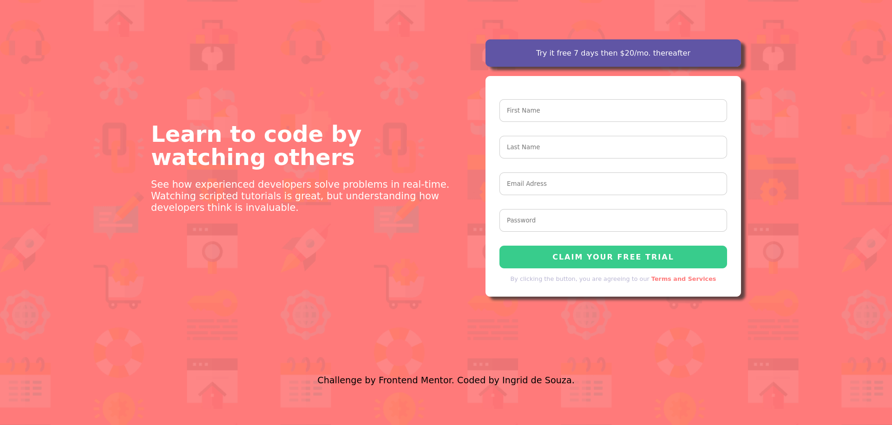
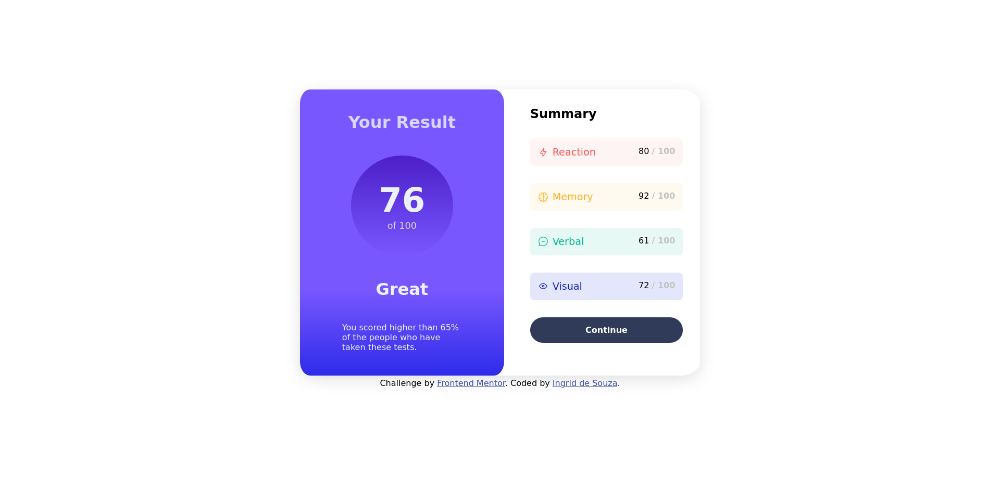

# Frontend Mentor - Desafios concluidos.
<strong>Lista dos desafios concluídos: </strong>
 

Product preview card component - <a href="product-preview-card-component-main/README.md">Here</a>

  

Intro component with sign up form - <a href="intro-component-with-signup-form-master/README.md">Here</a>

  

Results summary component - <a href="results-summary-component-main/README.md">Here</a>

  

 

[Frontend Mentor](https://www.frontendmentor.io) challenges help you improve your coding skills by building realistic projects.